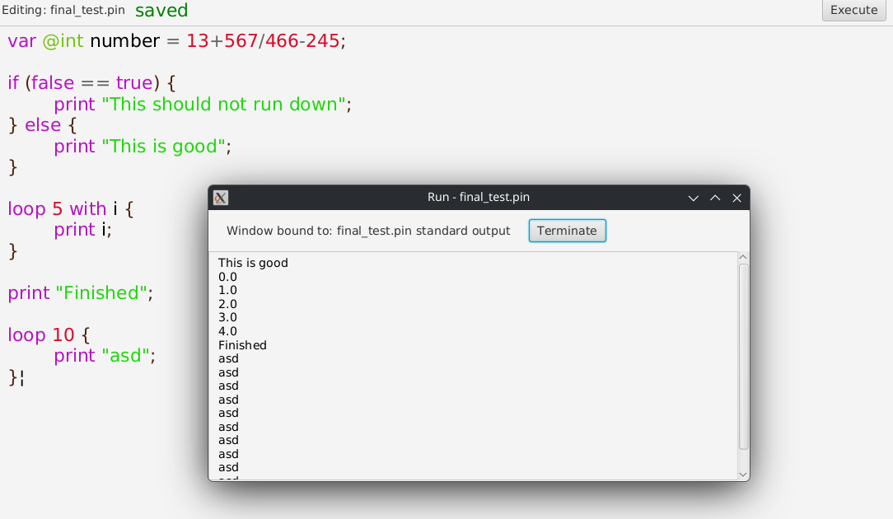

# PinVim IDE

---

## An Integrated Development Environment for the programming language [Pingy](https://github.com/Pingitzergggg/Pingy) built in Java FX


*Logo is AI Generated!*

---


## Why it exists

PinVim was created for the [Pingy](https://github.com/Pingitzergggg/Pingy) interpreted programming language as a simple, open source IDE. It is capable of opening, saving, creating and editing text files with added Pingy Syntax Highlight as well as running the written code with it's built in interpreter.

---

## Project Structure

Here is the map of where the main components of the app take place.

```
PinVim/
├── samples/
|    └── sample files
├── src/
|   ├── main/
|   |   ├── java/
|   |   |   ├── pingy/
|   |   |   |   └── files of the interpreter
|   |   |   ├── pinvim.com.pinvim/
|   |   |   |   ├── debugger/
|   |   |   |   |   └── Debugger launcher
|   |   |   |   ├── executor/
|   |   |   |   |   └── Executor launcher
|   |   |   |   ├── helper/
|   |   |   |   |   └── Helper launcher
|   |   |   |   ├── Controller
|   |   |   |   |   └── Controller files
|   |   |   |   ├── Model/
|   |   |   |   |   ├── ExecutorModel/
|   |   |   |   |   |   └── Model for Executor
|   |   |   |   |   └── Model files
|   |   |   |   ├── View/
|   |   |   |   |   └── View files
|   |   |   |   ├── Application.java
|   |   |   |   └── Launcher.java
|   |   |   └── module-info.java
|   |   └── resources/
|   |       └── pinvim.com.pinvim
|   |           ├── debugger/
|   |           |   └── Resource files for Debugger
|   |           ├── executor/
|   |           |   └── Resource files for Executor
|   |           ├── helper/
|   |           |   └── Resource files for Helper
|   |           ├── icon.png
|   |           ├── logo.png
|   |           ├── index.fxml
|   |           ├── style.scss  
```

### Structure explanation

- `Controller/` stores each controller for each part of the app. The main app controller is `Controller.java` every other controller takes up the `<Launcher Class Name>Controller.java`. This naming convention is present on every other important file regarding the MVC architecture.
- `Model/` stores the main Model and it's every subcomponent. These components strictly work only with background logic. Inside, subdirectories like `ExecutorModel/` contain the model structure for other subcomponents of the app that require to have their own background logic.
- `View/` store helper methods for rendering the GUI. This and the `resources/` directory implements the View part of the MVC model.
- `debugger/`, `executor/` and `helper/` store the launcher class for the specific subcomponent.
- `resources/` as stated before, implements the View of the app. It's structure strictly mirrors the one presented in `java/` due to FXML file loading conventions.

---

## How to use it

### Execute

***To run the app, you need JDK 25 and Java FX 21***

Upon executing `Launcher.java`, the empty text editor will pop up on your screen:


### The editor

From here, you can type and the text will appear behind the cursor. The editor supports syntax highlight for [Pingy](https://github.com/Pingitzergggg/Pingy) by default for the following tokens:

```java
private static final String[] keywords = {
        "var", "if", "elif", "else", "while", "for", "in", "print", "true", "false", "loop", "with", "by", "check"
};
private static final String[] types = {"@bool", "@string", "@byte", "@short", "@int", "@float", "@double", "@long"};
private static final Pattern operatorPattern = Pattern.compile("^[+\\-*/%=<>!|&^]$");
private static final Pattern separatorPattern = Pattern.compile("^[{}();]$");
private static final Pattern numericPattern = Pattern.compile("^[+\\-]?(0|0\\.0|([1-9][0-9]*(\\.[0-9]+)?))$");
```

This covers every main keyword and operator as well as separator characters like `{} () ;`.
`numericPattern` detects numeric values.
String values are extracted later on:
```java
private static HashMap<String, Object> extractStringLiterals(int index, String[] sequence) {
    StringBuilder bldr = new StringBuilder();
    bldr.append("\"");
    for (int i = index+1; i < sequence.length; ++i) {
        if (sequence[i].equals("\"")) {
            HashMap<String, Object> result = new HashMap<>();
            bldr.append("\"");
            result.put("index", i);
            result.put("value", bldr.toString());
            return result;
        } else {
            bldr.append(sequence[i]);
        }
    }
    return null;
}
```

### Syntax highlight
Pinvim Syntax Highlight works with token detection. Every single space-separated character sequence can count as a token.

#### Code breakdown
1. `Tab.java` acquires the input and calls `GentleSplitter.java` for the `"^[+\\-*/%=<>!|&^{}();,\\s\\t]$"` regex and passes it as a parameter to an instance of `CodeBase.java`.
2. `GentleSplitter.java` functions similarly to the built in `split()` method, except it keeps all the breaking points and appends them as separate values into the array that gets returned.
3. With the input as an array, `CodeBase.java` is now able to iterate through every value.
4. Every value then gets forwarded as a parameter to an instance of the `Token.java` class.
5. On initialization, `Token.java` evaluates the parameter given to it, and decides what type of syntax highlight should it get. It does this with the attributes presented here before:
```java
public Token(String value) {
    this.value = value;
    for (String type : types) {
        if (value.equals(type)) {
            this.type = TokenTypes.TYPE;
            return;
        }
    }
    for (String keyword : keywords) {
        if (value.equals(keyword)) {
            this.type = TokenTypes.KEYWORD;
            return;
        }
    }
    if (operatorPattern.matcher(value).matches()) {
        this.type = TokenTypes.OPERATOR;
    } else if (separatorPattern.matcher(value).matches()) {
        this.type = TokenTypes.SEPARATOR;
    } else if (numericPattern.matcher(value).matches()) {
        this.type = TokenTypes.NUMERIC;
    } else if (value.split("")[0].equals("\"")) {
        this.type = TokenTypes.STRING;
    } else if (value.equals("\u00a6")) {
        this.type = TokenTypes.CURSOR;
    } else {
        this.type = TokenTypes.DEFAULT;
    }
}
```
6. While `CodeBase.java` iterates through it's input. It adds every new `Token` to it's output array of type `LinkedList<Token>`.
7. Then, this output will be available to `Tab.java` via the `getOutput()` method.
8. An instance of `Tab.java` is created in `Model.java`. In future advancements, this structure would allow the app to handle multiple tabs at the same time. For now, with the one tab implementation `Model.java` kind of looks like a useless middleman, but keep in mind that this approach successfully validates the Open-Closed element of the SOLID principle!
9. The `Controller.java`, which has the `keyPressed` and `keyReleased` event listeners appends the input with each key, and gets the `LinkedList<Token>` output right after. It communicates with `Tab.java` through the `getTab()` method located in `Model.java` of which the controller has an instance of:
10. Then colors get assigned to the tokens in `View.java`'s `getColorCodeForType()` method which is called inside the same class at `getTextFlowContent()`. This produces a `Text[]` array that is filled into the output `TextFlow`:
```java
public Text[] getTextFlowContent(LinkedList<Token> tokens) {
    if (tokens == null) return new Text[0];
    Text[] coloredContent = new Text[tokens.size()];
    for (int i = 0; i < tokens.size(); ++i) {
        Text text = new Text(tokens.get(i).getValue());
        text.setFont(Font.font("ariel", this.fontSize));
        text.setFill(Color.web(getColorCodeForType(tokens.get(i).getType())));
        coloredContent[i] = text;
    }
    return coloredContent;
}
```

#### Example code


As you can see, each type of token has a unique color:
- `KEYWORD` -> #b812c4
- `VARIABLE` -> #1280c4
- `TYPE` -> #74c412
- `OPERATOR` -> #636363
- `SEPARATOR` -> #4f230d
- `NUMERIC` -> #d90928
- `STRING` -> #1dd909
- `DEFAULT` -> #000000

*If you'd like to know more about Pingy's syntax, I recommend reading the [Pingy Documentation on GitHub](https://github.com/Pingitzergggg/Pingy)*

### File handling

PinVim is capable of **Creating**, **Updating** and **Reading** text files of any kind, however keep in mind, that it will assign Pingy Syntax Highlight to it's content nevertheless.

#### Read

To read a file, you can click the `File` option on the MenuBar. This will initialize more dropdown options. Click `Open` or press `Ctrl+O` to open the default file explorer of your system through a pre-defined API:
<br>


#### Write and Create

You can freely create files in the file explorer popup, or alternatively, the original blank page in the beginning called `Untilted.pin` can be edited and saved later as a file. To do that, press `Ctrl+S` or click `Save` or `Save As` under the `File` MenuItem.
<br><br>
Difference between `Save` and `Save As`: <br>
`Save` automatically saves to the specified file if exists, if not, it will initialize the file explorer popup menu to create or select a file to save to.
`Save As` will always initialize the popup.

#### State indicator
The saved indicator, next to the filename indicator, display if the state of the file is exactly the same as the text inside the app's input. If they are, that means that the file is up to date and thus, the `saved` text will appear in green.

Otherwise the `*unsaved` text will appear in red.


### Running and Debugging
To run the Pingy script, loaded into the file. Just click the `Interpreter` MenuItem to initialize the dropdown, and then click `Run` or `Debug` or alternatively, press `Ctrl+Enter` to run quickly or just simply press the `Execute` button located in the file and state indicator bar.

<br>


The result will look something like this:



#### Handling the output popup

On the output popup window, you can press `Terminate` to terminate the running process and close the window. Optimally, the process will die after it finishes, and you can close the window with the `X` default navbar item of your OS whenever you like.

#### Difference between `Run` and `Debug`
- `Run`: Will simply execute the script and show the content of the Standard Output inside the popup as showed before.
- `Debug`: Will open another extra window that will show the content of the Debug Output. This stream is for info that helps track the processing of the interpreter with displaying variable states and conditions, etc...

***<font color="red">Important:</font> In version 1.0, the `Debug` option is not implemented as the used version of the interpreter is also lacking such features!***

---

## Interpreter Integration

The Pingy interpreter is located in the `pingy/` package. To run it, you must make an instance of `Main.java` and pass the path for the file that contains the script to the constructor:
```java
public class Main extends Thread {
    private final File file;

    public Main(File file) {
        this.file = file;
    }

    public void run() {
        Accessor.getInstance().clearTable();
        Pool.getInstance().clearPools();
        Divider source = new Divider(file.getPath());
        Register engine = new Register(source.getCodeBase());
        try {
            engine.start();
        } catch (InterruptedException e) {
            Pool.getInstance().printToErrorStream("InterruptError: Session terminated!");
            throw new RuntimeException(e);
        }
    }
}
```

This class derives from `Thread` and overrides its `run()` method. Once your instance is created you can start the interpreter by calling `start()` on it. This will start the process in a new Thread. To stop the process, call the `interrupt()` method, or wait until its finished.

<br>

PinVim starts the thread from `ExecutorController.java`. Since this process is associated with the `Executor` window:
```java
public void execute(File file) {
    if (title != null) title.setText("Window bound to: "+file.getName()+" standard output");
    this.interpreter = new Main(file);
    interpreter.setDaemon(true);
    interpreter.start();
    detectOutputStreamChanges();
}
```

Pingy provides access to its outputs via the `Pool.java` class. The `Executor` window interacts with this class in a thread to spare the limited processing capability of JFX's single thread. 
The change in the given stream is detected and showed on the screen. Every iteration's content is an entire `Text` node instead of separating and creating an instance for each line, because Java FX is really not good with writing so many single instances in such short time periods:
```java
Thread printer = new Thread(() -> {
    ExecutorModel.init();
    boolean dumpBeforeTerminate = false;
    while (true) {
        if (!interpreter.isAlive() || interpreter.isInterrupted()) dumpBeforeTerminate = true;
        ExecutorModel.run();
        LinkedList<String> changedOutput = ExecutorModel.getChangedOutputState() == null ? new LinkedList<>() : ExecutorModel.getChangedOutputState();
        LinkedList<String> changedError = ExecutorModel.getChangedErrorState() == null ? new LinkedList<>() : ExecutorModel.getChangedErrorState();
        LinkedList<LinkedList<String>> streamCollection = new LinkedList<>(List.of(changedOutput, changedError));
        for (int i = 0; i < streamCollection.size(); ++i) {
            LinkedList<String> collection = streamCollection.get(i);
            if (!collection.isEmpty()) {
                StringBuilder bldr = new StringBuilder();
                for (String value : collection) {
                    bldr.append(value);
                }
                Text printable = new Text(bldr.toString());
                printable.setStyle(i == 0 ? "-fx-text-fill: black;" : "-fx-text-fill: red;");
                Platform.runLater(() -> outputDisplay.getChildren().add(printable));
            }
        }
        if (dumpBeforeTerminate) break;
        try {
            Thread.sleep(100);
        } catch (InterruptedException e) {
            throw new RuntimeException(e);
        }
    }
});
```
Similarly to how the `Model.java` handles background logic for the main app, `ExecutorModel.java` provides the comparing mechanism for this process, to segregate functioning according to the MVC model:
```java
public static void run() {
    LinkedList<String> newState = new LinkedList<>(pool.getOutputStream());
    if (newState.size() > oldOutputState.size()) {
        changedOutputState = new LinkedList<>();
        for (int i = processedOutputLines + 1; i < newState.size(); ++i) {
            changedOutputState.add(newState.get(i));
            processedOutputLines = i;
        }
        oldOutputState = newState;
    }
    newState = new LinkedList<>(pool.getErrorStream());
    if (newState.size() > oldErrorState.size()) {
        changedErrorState = new LinkedList<>();
        for (int i = processedErrorLines + 1; i < newState.size(); ++i) {
            changedErrorState.add(newState.get(i));
            processedErrorLines = i;
        }
        oldErrorState = newState;
    }
}
```

